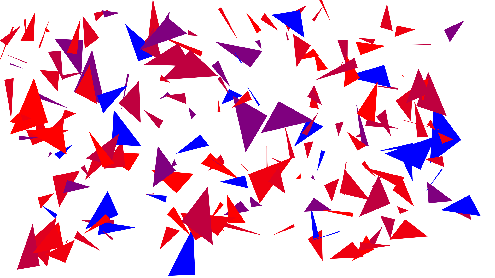

# TEXTURE CREATER

Just4Fun!
## Описание

Создание текстуы из треугольников.

Параметры: минимальный и максимальный размер треугольников. Разрешение изображения текстуры. Цвет фона. Цвета треугольников - используется 6 цветов - мы задаём начальный и конечный цвет - остальные средние цвета между ними.

## RESULT 

