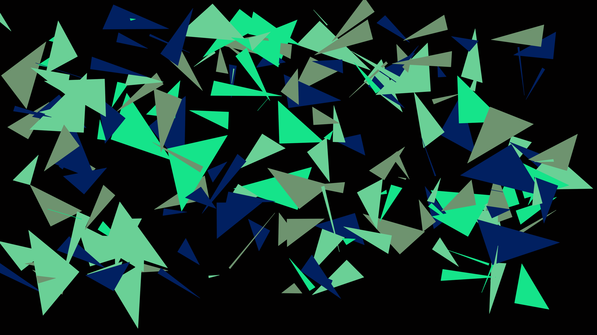
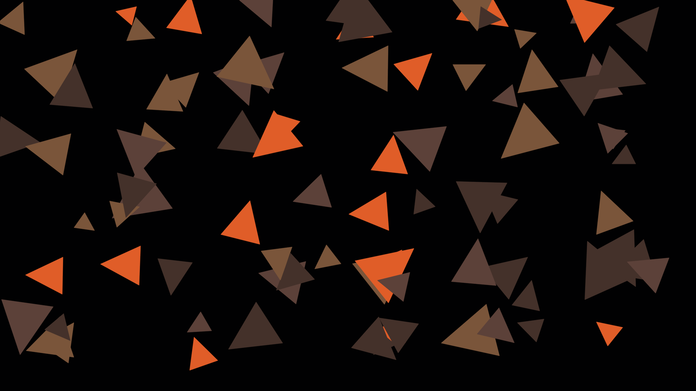
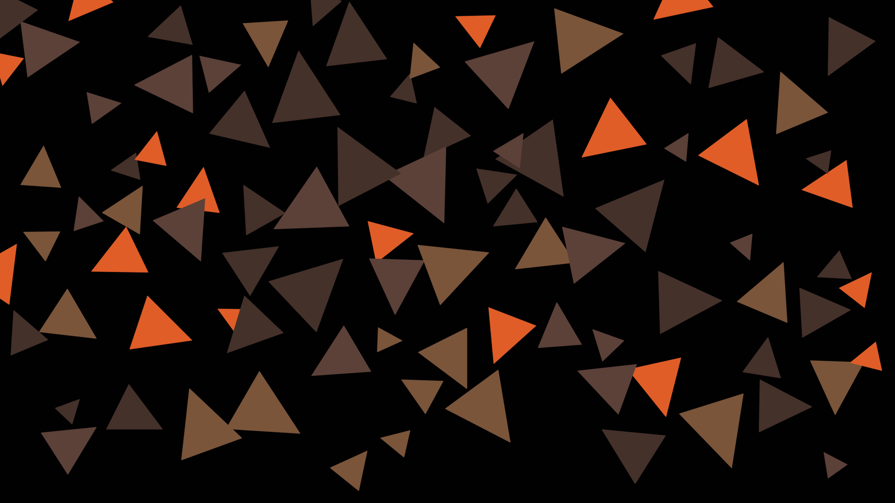
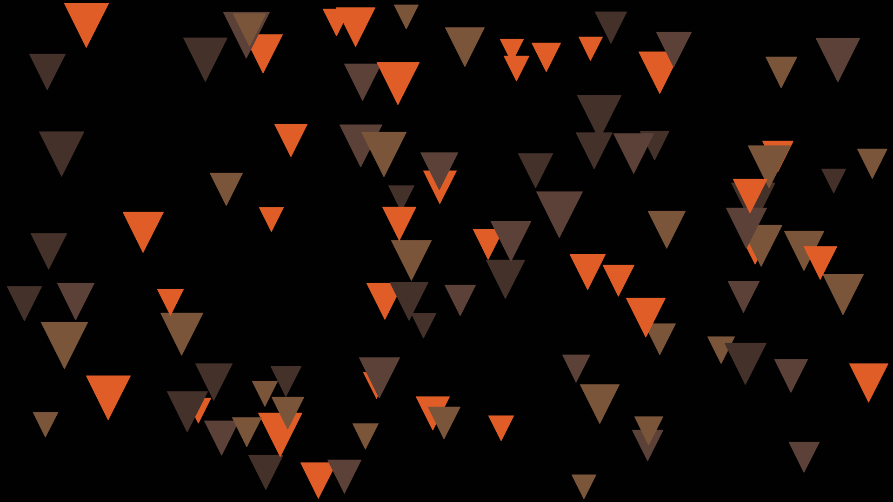

# TEXTURE CREATER

Just4Fun!
## Описание

Создание текстуы из треугольников.

## Равномерность и контроль хаоса

Для равномерного, но хаотичного распределения треугольников по изображению можно использовать следующие подходы:

1. Разбиение изображения на сетку: Разделите изображение на равные ячейки сетки и разместите треугольники внутри каждой ячейки случайным образом. Это позволит достичь равномерного распределения треугольников по всему изображению, но с хаотичным размещением внутри каждой ячейки.
2. Пошаговое размещение: Размещайте треугольники пошагово на изображении, начиная с первого треугольника. Для каждого следующего треугольника выбирайте случайную позицию, которая еще не занята другим треугольником. Это позволит равномерно распределить треугольники по изображению с хаотичным порядком размещения.
3. Метод Монте-Карло: Генерируйте случайные координаты для каждого треугольника в пределах изображения. Затем проверяйте, не пересекается ли треугольник с другими уже размещенными треугольниками. Если треугольник пересекается, генерируйте новые координаты. Повторяйте этот процесс до тех пор, пока не будет достигнуто желаемое количество треугольников. Этот метод позволяет достичь хаотичного распределения треугольников с контролируемой плотностью.

### Реализация

`app_creator_general.py` - random без контороля



`app_creator_uniformity_mesh.py` - разбиение изображения на сетку



`app_creator_step-by-step_placement.py` - пошаговое размещение



`app_creator_monte-carlo_method.py` - метод Монте-Карло (-ещё не доделал-)



## Tree 

```
.
├── app_creator_general.py
├── app_creator_monte-carlo_method.py
├── app_creator_step-by-step_placement.py
├── app_creator_uniformity_mesh.py
├── _draft.md
├── README.md
├── requirements.txt
├── test_ex.py
├── texture_general.png
├── texture_monte-carlo_method.png
├── texture_step-by-step_placement.png
└── texture_uniformity_mesh.png
```

## Some more

triangle_colors = [(224, 93, 40), (122, 85, 58), (68, 49, 42), (92, 65, 57)] # Orange-Brown frome CoD