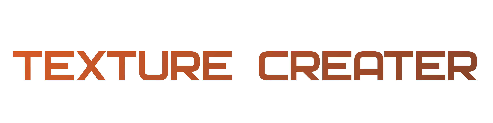
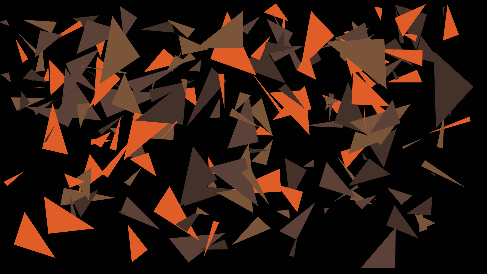
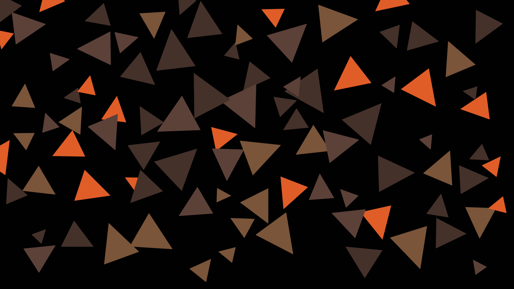
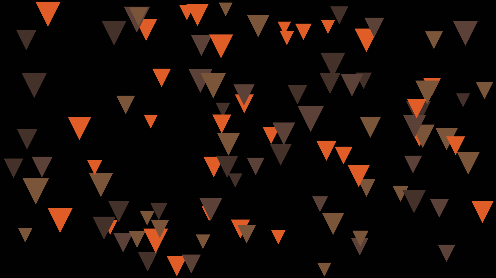

# TEXTURE CREATER

Just4Fun!
## Описание

Создание текстуы из треугольников.

## Равномерность и контроль хаоса

Для равномерного, но хаотичного распределения треугольников по изображению можно использовать следующие подходы:

1. Разбиение изображения на сетку: Разделите изображение на равные ячейки сетки и разместите треугольники внутри каждой ячейки случайным образом. Это позволит достичь равномерного распределения треугольников по всему изображению, но с хаотичным размещением внутри каждой ячейки.
2. Пошаговое размещение: Размещайте треугольники пошагово на изображении, начиная с первого треугольника. Для каждого следующего треугольника выбирайте случайную позицию, которая еще не занята другим треугольником. Это позволит равномерно распределить треугольники по изображению с хаотичным порядком размещения.
3. Метод Монте-Карло: Генерируйте случайные координаты для каждого треугольника в пределах изображения. Затем проверяйте, не пересекается ли треугольник с другими уже размещенными треугольниками. Если треугольник пересекается, генерируйте новые координаты. Повторяйте этот процесс до тех пор, пока не будет достигнуто желаемое количество треугольников. Этот метод позволяет достичь хаотичного распределения треугольников с контролируемой плотностью.

### Реализация

`app_creator_general.py` - random без контороля

`app_creator_uniformity_mesh.py` - разбиение изображения на сетку

`app_creator_step-by-step_placement.py` - пошаговое размещение

`app_creator_monte-carlo_method.py` - метод Монте-Карло (-ещё не доделал-)

## Some more

triangle_colors = [(224, 93, 40), (122, 85, 58), (68, 49, 42), (92, 65, 57)] # Orange-Brown from CoD

# texture_creator_general.py

Этот скрипт на языке Python создает текстуру, состоящую из случайно расположенных и повернутых треугольников различного размера и цвета. 

Краткое описание функций и параметров:

1. **generate_texture**: Функция создает изображение текстуры, заполняя его случайными треугольниками. Принимает параметры, такие как количество треугольников, размер треугольников, разрешение текстуры, цвет фона, альфа-каналы и цвета треугольников.

2. **generate_triangle_properties**: Генерирует случайные свойства треугольника, такие как координаты (x, y), ширина, высота и угол поворота.

3. **rotate_triangle**: Поворачивает треугольник вокруг заданного центра на заданный угол.

4. **calculate_scale_factor**: Рассчитывает масштабный коэффициент на основе разрешения.

5. **generate_unique_colors**: Генерирует уникальные цвета для треугольников, не слишком близкие к цвету фона.

6. **create_triangle_texture_image**: Основная функция, которая задает параметры текстуры, вызывает функции для ее создания и сохраняет в файл.

При запуске скрипта создается текстурное изображение с именем 'result_images/texture_general.png'.